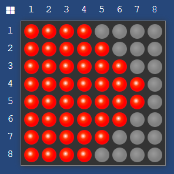
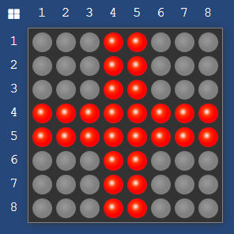
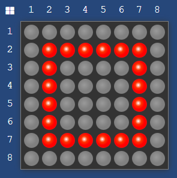

# LEDMatrix8x8 Library
The LEDMatrix8x8 library provides an easy way to control an 
8x8 LED matrix using the MAX7219 driver. This library allows you to 
initialize the matrix, set individual pixels, display letters, words and sentences, 
and even show text or pattern animations with customizable durations.


## Installation


To use this library, download the `LEDMatrix8x8.cpp` and `LEDMatrix8x8.h` files and place them in your Arduino libraries folder.


## Getting Started


### Constructor
```
LEDMatrix8x8::LEDMatrix8x8(int dataPin, int clockPin, int latchPin, Brightness brightness);
```

Create an instance of the LEDMatrix8x8 class by providing:
- Data pin number
- Clock pin number
- Latch pin number
- Brightness level


### Initialization
```
void LEDMatrix8x8::begin();
```

Initialize the 8x8 matrix and set up communication with the MAX7219 driver. 
This method must be called before using other functions of the library.


### Predefined data types
- **AnimationType:** \
- RHOMBUS:\


- LEFT_ARROW:\


- RIGHT_ARROW:\


- LOADING_BAR:\


- HEARTBEAT:\


- SQUARE:\

  
- **AnimationMode:**
  - UP
  - DOWN
  
- **Brightness:**
  - MINIMAL
  - LOW
  - MEDIUM
  - HIGH
  - MAX
  
- **State:**
  - ON
  - OFF


## Setting Pixels
```
void LEDMatrix8x8::setPixel(int x, int y, State state);
```

Set the state of a pixel at the specified position (x, y). State can be either ON or OFF.


## Clearing the Display
```
void LEDMatrix8x8::clear();
```

Clear the entire display matrix, turning off all pixels (setting the state to OFF).


## Displaying Characters
```
void LEDMatrix8x8::displayCharacter(char ch, int duration);
```

Display an ASCII character on the screen for the specified duration.


## Displaying Text
```
void LEDMatrix8x8::displayText(String text, int delay);
```

Display a block of text on the screen, letter by letter, at the provided intervals. The delay parameter specifies the time interval (in milliseconds) between displaying each character.


## Displaying Animations
```
void LEDMatrix8x8::displayAnimation(AnimationType animationType, AnimationMode animationMode, int duration);
```

Display an animation on the screen for the specified direction and duration.


## Scrolling Text
```
void LEDMatrix8x8::scrollText(String text, AnimationType animationType, int delay);
```

Display the provided text as a scrolling animation with the specified direction and delay between frames.


## Example Usage
```
#include <LEDMatrix8x8.h>

LEDMatrix8x8 matrix(2, 3, 4, Brightness.MEDIUM); // Data Pin: 2, Clock Pin: 3, Latch Pin: 4, Brightness: medium

void setup() {
    matrix.begin();
}

void loop() {
    matrix.displaySentence("HELLO WORLD", 500); // Display "HELLO WORLD" with a delay of 500ms between characters
}
```

## Contributing
If you find any issues or have suggestions for improvements, please create an issue or a pull request on GitHub.

## License
This project is licensed under the MIT License
